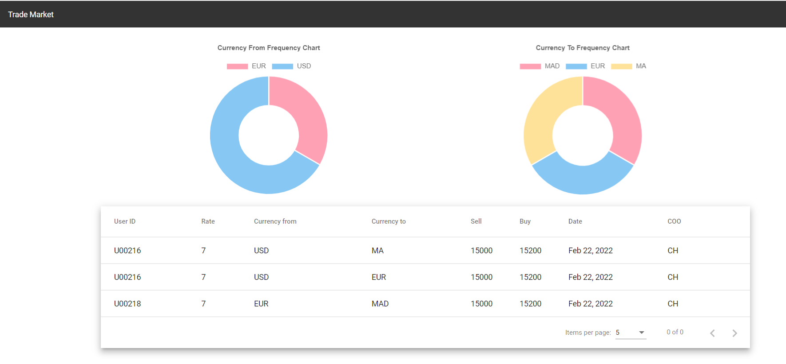

#Market Trading Quick APP
Quick application to handle the register message in real time by using sockets.
##Prerequisites
You should install maven3+ and java11+ in your machine and add them to classpath.

##Backend start
* Clone the frontend `git clone ...`
* go the app folder `cd market-trading-processor/market-trading-processor-backend`
* run the command `mvn clean install`
* run Spring boot app `mvn spring-boot:run` or open the spring boot intellij and run it manually.
## Frontend Start the application
* go the app folder `cd market-trading-processor/market-trading-processor-frontend`
* Run the command `npm install` to install the needed dependencies already defined in package.json.
* Run `ng serve` for a dev server. Navigate to `http://localhost:4200/`.

